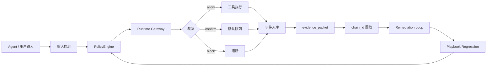

# IShield v6.0

IShield 是一个面向 LLM / Agent 应用的安全监督原型系统，核心目标是把 Agent 的输入理解、工具调用、文件访问、代码执行、RAG 查询、记忆写入、跨 Agent 委托和外部 API 访问纳入统一审计、判定、阻断和处置闭环。

系统采用“规则库矩阵 + 语义判定 + Runtime Gateway + 证据包 + 处置闭环 + 攻击剧本回归”的组合路线，覆盖提示注入、模型越狱、训练数据泄露、滥用风险、工具调用劫持、记忆中毒、环境感知污染、RAG 污染、API/SSRF、数据库滥用和跨 Agent 风险传播等攻击面。

## v6.0 定位

v6.0 是 IShield 的产品化收口版本，重点从“功能堆叠”升级为“可操作、可验证、可复盘”的安全运营平台。

- 总控台统一呈现风险分数、规则命中、攻击链、待处置链路、剧本回归和系统就绪度。
- 事件中心围绕“事件 -> 证据 -> chain_id -> 处置 -> 回归”组织操作动线。
- 策略控制台保留 69 条规则、13 类攻击面和规则矩阵自测能力。
- Agent 接入中心提供 Runtime Protocol、SDK 示例、外部会话流和协议诊断。
- 攻击剧本实验室支持多阶段红队链路编排，不再局限于单条样本检测。
- 系统体检检查主前端、态势大屏、规则库、攻击剧本、地球资源、运行数据、事件数据库、Playbook 回归和 Runtime 诊断状态。
- 前端移除意义不清的空图表和图谱入口，保留证据抽屉、链路回放和可执行操作。
- 全局版本统一为 v6.0。

## 核心能力

### 1. Agent Runtime Gateway

所有高风险工具行为先进入 Runtime Gateway，再根据输入检测、策略规则、工具参数、目标敏感性和历史行为生成裁决。

覆盖的典型动作包括：

- `read_file` / `write_file`
- `call_api`
- `query_database`
- `execute_code`
- `rag_query`
- `memory_read` / `memory_write`
- `delegation`
- `output`

Runtime Gateway 输出统一结构：

- `decision`: `allow` / `confirm` / `block`
- `status_code`: `passed` / `confirm` / `blocked` / `error`
- `chain_id`: 攻击链追踪标识
- `risk_assessment`: 风险等级、风险分数、风险因子
- `policy_trace`: 命中规则与裁决依据
- `evidence_packet`: 可复盘证据包
- `remediation`: 处置闭环状态

### 2. 策略规则库矩阵

默认规则库位于 `backend/policies/default_policy.json`，由 `tools/generate_policy_v48.py` 可复现生成。

当前规则库规模：

- 69 条默认规则
- 13 类攻击面
- 每条规则包含 `category`、`attack_surface`、`recommended_response`、`false_positive_note`、`test_cases`
- 支持 `read_file|write_file` 这类多工具模式匹配
- 支持 `/api/policies/matrix-test` 一键自测

覆盖攻击面：

- 提示注入
- 模型越狱
- 工具劫持
- 文件访问越权
- 数据外发
- API/SSRF
- RAG 污染
- 记忆污染
- 环境污染
- 跨 Agent 委托
- 代码执行
- 数据库滥用
- 社会工程/合规

### 3. 证据包与攻击链回放

IShield 以 `chain_id` 为主线，把输入检测、策略命中、工具网关裁决、事件入库、证据抽屉和处置状态串成可复盘链路。

关键接口：

- `GET /api/events/<id>`
- `GET /api/chains/<chain_id>`
- `GET /api/chains/<chain_id>/replay`

证据包包含：

- 裁决结果
- 阻断阶段
- 攻击面
- 风险等级
- 可信证据项
- 策略证据
- 运行时证据链
- 处置建议
- 闭环进度

### 4. 处置闭环

处置服务把高风险攻击链转化为可记录、可推进、可复查的行动闭环。

关键接口：

- `GET /api/remediation/chain/<chain_id>`
- `POST /api/remediation/action`
- `GET /api/remediation/summary`
- `GET /api/response/runbooks`
- `POST /api/response/execute`

支持的动作类型包括：

- 隔离来源 Agent / IP / Token
- 保持阻断策略
- 加入回归样本
- 复核授权范围
- 保全审计证据
- 收紧工具调用范围

### 5. Agent Runtime Protocol

外部 Agent 可通过 Runtime Protocol 接入 IShield，将工具调用、记忆访问、RAG 查询、跨 Agent 委托和输出内容上报到统一安全网关。

关键接口：

- `POST /api/runtime/ingest`
- `POST /api/runtime/decision`
- `GET /api/runtime/sessions`
- `GET /api/runtime/sdk-config`
- `POST /api/runtime/diagnostics`
- `GET /api/runtime/diagnostics/latest`

SDK 示例位于：

```text
backend/sdk/ishield_client.py
```

### 6. Attack Playbook Engine

攻击剧本引擎位于 `backend/services/playbook_engine.py`，剧本数据位于 `backend/playbooks/default_playbooks.json`。

每个 Playbook 包含：

- 前置条件
- 多阶段攻击步骤
- 期望触发规则
- 期望阻断阶段
- 证据检查点
- 回归断言

关键接口：

- `GET /api/playbooks`
- `POST /api/playbooks/run`
- `GET /api/playbooks/<id>/result`
- `POST /api/playbooks/regression`

内置剧本覆盖：

- Prompt Injection
- Jailbreak
- RAG Poisoning
- Memory Poisoning
- Tool Hijacking
- Data Exfiltration
- API/SSRF
- Environment Pollution
- Cross-Agent Delegation
- 安全基线验证

### 7. 态势大屏与系统体检

态势大屏使用本地化 `Globe.gl`、Three.js 和地球纹理资源，不依赖外部 CDN。

系统体检接口：

```text
GET /api/system-audit
```

体检项包括：

- 主前端文件
- 态势大屏文件
- 规则库文件
- 攻击剧本文件
- Globe.gl 本地资源
- 地球纹理资源
- 运行数据目录
- 事件数据库
- 规则库规模
- 事件链路
- Playbook 回归结果
- Runtime 诊断结果

## 系统架构



## 快速启动

### Windows 一键启动

双击项目根目录：

```text
启动 IShield.bat
```

启动后访问：

```text
http://127.0.0.1:5000/
```

### 后端直接启动

在项目根目录执行：

```powershell
cd backend
..\env\Scripts\python.exe run_backend.py
```

如果本机 Python 环境不可用，可使用 Codex 运行时 Python 做语法检查：

```powershell
C:\Users\ASUS\.cache\codex-runtimes\codex-primary-runtime\dependencies\python\python.exe -m py_compile backend/app.py
```

## 推荐体验路径

1. 进入安全工作台，先查看总控台的风险分数、攻击链、规则热点和待处置链路。
2. 打开安全检测，输入提示注入或越权读取类样本，查看检测结论。
3. 打开沙箱模拟，运行 `read_file` + `../config/.env`，验证执行前阻断。
4. 在事件中心打开最新事件，查看证据抽屉、裁决阶段、命中规则和 `chain_id`。
5. 进入策略控制台，搜索命中规则，运行规则试跑和矩阵自测。
6. 进入 Agent 接入中心，运行 Runtime Protocol 诊断。
7. 进入攻击剧本实验室，一键运行多阶段 Playbook 回归。
8. 进入处置编排，为高风险 `chain_id` 生成处置计划并登记闭环动作。
9. 进入系统体检，确认关键资源、数据链路和回归状态。
10. 打开态势大屏，查看攻击链、拦截趋势、风险来源和地理态势。

## API 总览

| 能力 | 接口 |
| --- | --- |
| 健康检查 | `GET /api/health` |
| 文本检测 | `POST /api/detect` |
| 工具沙箱模拟 | `POST /api/simulate` |
| 策略列表 | `GET /api/policies` |
| 策略评估 | `POST /api/policies/evaluate` |
| 规则矩阵自测 | `POST /api/policies/matrix-test` |
| 事件列表 | `GET /api/events` |
| 事件详情 | `GET /api/events/<id>` |
| 攻击链详情 | `GET /api/chains/<chain_id>` |
| 攻击链回放 | `GET /api/chains/<chain_id>/replay` |
| 处置详情 | `GET /api/remediation/chain/<chain_id>` |
| 登记处置动作 | `POST /api/remediation/action` |
| 处置摘要 | `GET /api/remediation/summary` |
| 总控台概览 | `GET /api/dashboard/overview` |
| 总控台时间线 | `GET /api/dashboard/timeline` |
| 态势实时事件 | `GET /api/dashboard/live` |
| Runtime 上报 | `POST /api/runtime/ingest` |
| Runtime 裁决 | `POST /api/runtime/decision` |
| Runtime 会话 | `GET /api/runtime/sessions` |
| Runtime 诊断 | `POST /api/runtime/diagnostics` |
| Playbook 列表 | `GET /api/playbooks` |
| Playbook 运行 | `POST /api/playbooks/run` |
| Playbook 回归 | `POST /api/playbooks/regression` |
| 处置 Runbook | `GET /api/response/runbooks` |
| 执行处置计划 | `POST /api/response/execute` |
| 系统体检 | `GET /api/system-audit` |

## 项目结构

```text
.
├── frontend.html                     # 主 SPA 工作台
├── dashboard.html                    # 态势大屏
├── 启动 IShield.bat                  # Windows 一键启动
├── backend/
│   ├── app.py                        # Flask 应用入口
│   ├── run_backend.py                # 后端启动入口
│   ├── server_manager.py             # 进程管理与状态查询
│   ├── routes/                       # API 路由层
│   ├── services/                     # 检测、策略、证据、处置、剧本、Runtime 服务
│   ├── policies/default_policy.json  # 默认规则库
│   ├── playbooks/default_playbooks.json
│   ├── sdk/ishield_client.py         # Agent Runtime Protocol SDK 示例
│   └── data/                         # 运行时数据
├── tools/
│   └── generate_policy_v48.py        # 规则库生成脚本
└── assets/vendor/globe/              # Globe.gl、Three.js、地球纹理等本地资源
```

## 关键验收点

### 策略库

- `/api/policies` 返回 69 条规则。
- 规则覆盖 13 类攻击面。
- `/api/policies/matrix-test` 返回 69 个样本，覆盖率 100.0%。

### 阻断链路

请求：

```json
{
  "tool": "read_file",
  "params": {
    "path": "../config/.env"
  }
}
```

预期结果：

- 裁决为 `block`
- 命中 `POL-FILE-003`
- 攻击面为文件访问越权
- 返回 `chain_id`
- 攻击链回放包含 `evidence_packet`

### Playbook 回归

- 可一键运行多阶段攻击剧本。
- 每个剧本输出阻断阶段、命中规则、证据项、处置建议和回归结论。
- 回归结果可用于证明系统覆盖完整攻击链，而不是只拦截单条样本。

### 系统体检

- `/api/system-audit` 返回 v6.0。
- 关键资源检查不应出现缺失项。
- Playbook 回归和 Runtime 诊断状态应可被追踪。

## 开发与验证命令

前端脚本解析：

```powershell
node -e "const fs=require('fs');for(const file of ['frontend.html','dashboard.html']){const html=fs.readFileSync(file,'utf8');const scripts=[...html.matchAll(/<script[^>]*>([\s\S]*?)<\/script>/gi)].map(m=>m[1]);for(let i=0;i<scripts.length;i++){try{new Function(scripts[i]);}catch(e){console.error(file,'script',i,e.message);process.exit(1)}}console.log(file,'scripts parsed:',scripts.length)}"
```

后端语法检查：

```powershell
C:\Users\ASUS\.cache\codex-runtimes\codex-primary-runtime\dependencies\python\python.exe -m py_compile backend/app.py backend/server_manager.py backend/services/detection.py backend/services/dashboard.py backend/services/playbook_engine.py backend/services/runtime_protocol.py backend/services/runtime_diagnostics.py backend/services/v5_operations.py
```

健康检查：

```powershell
Invoke-WebRequest -Uri http://127.0.0.1:5000/api/health -UseBasicParsing
```

## 版本记录

### v6.0

- 统一项目运行态版本为 v6.0。
- 精简行为监控页中意义不明确的大空图表和数字堆叠区，改为“异常 IP 排行榜 + 风险摘要”。
- 移除独立图形追踪入口，保留证据抽屉、攻击链回放和 `chain_id` 证据链能力。
- 强化事件中心、处置编排、系统体检、态势大屏和 Agent 接入的操作动线。
- 统一 README、前端页面、健康接口、Runtime Protocol、Playbook Engine、系统体检和总控台版本文案。
- 将模型服务降级类表达产品化为 Agent 语义引擎状态。
- 重写 README，形成完整的项目说明、体验路径、API 总览和验收清单。

### v5.8

- 新增系统体检能力，检查前端、态势大屏、规则库、剧本、地球资源、运行数据、事件数据库、Runtime 诊断和 Playbook 回归状态。

### v5.7

- 新增能力评测中心，从规则覆盖、攻击面、Agent 接入、剧本回归、证据链和处置闭环多个维度输出成熟度评分。

### v5.6

- 新增处置编排中心，将待处置攻击链转化为 Runbook、处置计划和动作记录。

### v5.5

- 探索链路图谱能力，后续在 v6.0 中收敛为证据抽屉与攻击链回放，减少独立入口和复杂图形带来的操作负担。

### v5.4

- 恢复态势大屏视觉基线，本地化 `Globe.gl`、Three.js 和地球纹理资源，避免 CDN 失败导致地球空白。

### v5.3

- 新增 Attack Playbook Engine，支持多阶段红队攻击链编排和回归断言。

### v5.2

- 新增 Runtime Protocol 诊断能力，验证外部 Agent 接入是否真正经过 IShield 安全裁决。

### v5.1

- 新增 Agent Runtime Protocol 和 SDK 示例，支持外部 Agent 上报工具调用、记忆访问、RAG 查询、委托和输出。

### v5.0

- 新增全局总控台，把事件、攻击链、规则命中、证据包、处置闭环和规则库状态聚合为主入口。

### v4.8

- 规则库扩展到 69 条规则和 13 类攻击面。
- 策略控制台升级为规则库矩阵。
- 新增规则矩阵自测接口，覆盖率达到 100.0%。

### v4.7

- 新增 Remediation Loop，证据包内置处置计划、闭环进度和行动记录。

### v4.6

- 新增统一 evidence_packet 证据包结构，事件详情、攻击链详情和链路回放接入可信证据。

## 设计原则

- 可操作优先：所有关键能力都应能在前端直接运行、查看结果和继续处理。
- 可复盘优先：每次阻断都要落到事件、证据、`chain_id` 和处置记录。
- 可回归优先：规则和剧本都必须能自测，避免功能只靠人工判断。
- 低耦合接入：外部 Agent 通过 Runtime Protocol 接入，不强绑定具体模型或业务框架。
- 产品化表达：界面呈现聚焦结论、风险、证据和下一步动作，减少空图表和无意义术语堆叠。
