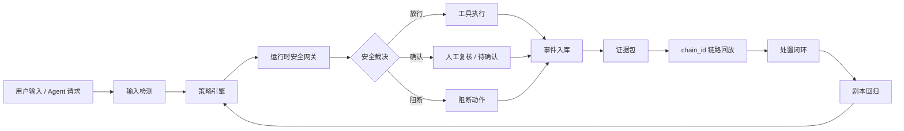

# IShield v6.0

> 面向大语言模型与智能体应用的运行时安全监督平台

`当前版本 v6.0` · `Windows 便携交付` · `本地启动` · `规则库 69 条` · `覆盖 13 类攻击面` · `后端验收 55 项通过`

IShield 不是一个单点提示词过滤器，而是一套围绕 Agent 运行时链路构建的安全监督系统。它把用户输入、模型输出、工具调用、文件访问、代码执行、RAG 查询、记忆读写、跨 Agent 委托和外部 API 访问纳入统一安全网关，在真实动作发生前完成审计、判定、阻断和取证。

系统最终形成一条完整闭环：

```text
输入检测 -> 策略裁决 -> 工具拦截 -> 事件入库 -> 证据包 -> 攻击链回放 -> 处置闭环 -> 回归验证
```

它的价值不在于“看起来能识别风险”，而在于可以现场运行、连续点击、生成证据、回放链路，并把攻击样本沉淀为可复测的安全能力。

## 为什么它强

| 能力维度 | IShield 的做法 | 体现出的优势 |
| --- | --- | --- |
| 运行时监督 | 在 Agent 工具执行前进入 Runtime Gateway | 不是事后日志，而是调用前裁决 |
| 攻击面覆盖 | 内置 69 条规则，覆盖 13 类典型攻击面 | 能对齐命题要求，不停留在单一 prompt |
| 证据链闭环 | 每次风险事件生成 `chain_id` 与 `evidence_packet` | 可复盘、可追责、可继续处置 |
| 红队验证 | 内置多阶段 Playbook 与矩阵自测 | 攻击样本不是静态文本，而是可运行链路 |
| 工具调用防护 | 文件、API、数据库、代码执行、记忆、RAG 统一监管 | 覆盖智能体应用真正危险的外部动作 |
| 处置编排 | 高风险链路可生成处置计划和动作记录 | 从发现风险推进到闭环治理 |
| 交付形态 | 一个压缩包即可在新电脑启动 | 更接近真实产品，而不是源码工程 |

## 最终交付

最终只需要交付一个文件：

```text
release\IShield-Final-Package.zip
```

使用者解压后会看到：

```text
IShield\
  README.md
  IShield.exe
  _internal\
```

双击 `IShield.exe` 后，浏览器会自动打开：

```text
http://127.0.0.1:5000/
```

不要单独发送或移动 `IShield.exe`。它依赖同级 `_internal` 目录中的前端页面、后端服务、规则库、剧本库、静态资源和运行时 DLL。

## 五分钟体验路径

这条路线适合第一次使用时快速验证核心能力。

| 顺序 | 功能入口 | 操作 | 你应该看到什么 |
| --- | --- | --- | --- |
| 1 | 首页 / 工作台 | 进入系统 | 左侧功能导航可切换，顶部服务状态正常 |
| 2 | 安全检测 | 选择内置高风险样本并运行 | 风险等级、命中规则、检测依据、处置建议 |
| 3 | 沙箱模拟 | 运行越权文件读取或外部 API 调用 | 工具调用被裁决为放行、确认或阻断 |
| 4 | 事件中心 | 刷新事件并打开详情 | `status_code`、运行结论、证据包、`chain_id` |
| 5 | 攻击链回放 | 从事件详情进入链路 | 输入、工具、规则、阻断阶段、证据项串联呈现 |
| 6 | 策略控制台 | 执行策略试跑和矩阵自测 | 规则批量命中，覆盖率可验证 |
| 7 | Agent 监控 | 运行危险工具调用示例 | 工具调用在执行前被审计、判定、记录 |
| 8 | Agent 集群审计 | 运行跨 Agent 委托场景 | 风险在多 Agent 链路中的传播与拦截过程 |
| 9 | 攻击剧本实验室 | 运行多阶段 Playbook | 阻断阶段、命中规则、证据检查点、回归结论 |
| 10 | 系统体检 / 态势大屏 | 检查系统并打开大屏 | 关键资源可用，全局风险态势可观察 |

## 攻击面覆盖

IShield 面向智能化应用的真实攻击面设计，不只处理输入文本。

| 攻击面 | 典型风险 | 系统响应 |
| --- | --- | --- |
| 提示注入 | 用户输入覆盖系统指令或开发者约束 | 输入检测、规则命中、事件入库 |
| 模型越狱 | 绕过安全边界输出违规内容 | 语义判定、策略裁决、风险记录 |
| 训练数据泄露 | 诱导模型泄露语料、密钥或内部信息 | 敏感信息识别、输出审计 |
| 滥用风险 | 自动生成诈骗、钓鱼、破坏性内容 | 攻击面分类、风险等级判定 |
| 工具调用劫持 | Agent 被诱导调用危险工具 | Runtime Gateway 调用前阻断 |
| 文件访问越权 | 读取 `.env`、密钥、上级目录文件 | 路径策略、沙箱裁决、证据包 |
| 代码执行 | 执行危险命令或逃逸沙箱 | 工具权限、参数规则、阻断记录 |
| API / SSRF | 请求内网地址或敏感服务 | URL / IP 策略、外联风险判定 |
| RAG 污染 | 检索内容携带恶意指令 | 上下文审计、污染规则命中 |
| 记忆中毒 | 写入长期恶意偏好或伪造事实 | 记忆写入审计、污染事件沉淀 |
| 环境感知污染 | 利用系统环境信息误导模型 | 环境上下文隔离、风险归因 |
| 跨 Agent 委托 | 风险任务在多个 Agent 间传递 | 集群链路审计、传播路径回放 |
| 数据库滥用 | 高风险查询、批量导出或越权检索 | 查询策略、异常判定、处置建议 |

## 系统架构



核心思路是把智能体行为拆成可观测、可裁决、可复盘的运行时链路。模型可以生成计划，但真正触达文件、网络、数据库、代码执行和外部系统之前，必须经过 IShield 的安全网关。

## 核心模块

| 模块 | 作用 | 核心能力 |
| --- | --- | --- |
| 总控台 | 聚合全局风险和运行状态 | 风险分数、事件趋势、待处置链路、系统状态 |
| 安全检测 | 判断输入、上下文和输出风险 | 提示注入、越狱、泄露、滥用检测 |
| 沙箱模拟 | 模拟真实工具调用 | 文件、API、数据库、代码执行、记忆、RAG |
| 接入中心 | 接入外部 Agent | Runtime Protocol、SDK 配置、协议诊断 |
| Agent 监控 | 监督单 Agent 行为 | 注册、调用记录、危险工具调用验证 |
| Agent 集群审计 | 分析多 Agent 链路 | 委托、越权、风险传播、链路回放 |
| 策略控制台 | 管理和验证规则库 | 规则列表、策略试跑、矩阵自测 |
| 事件中心 | 查看审计与阻断记录 | 运行结论、状态码、证据包、攻击链入口 |
| 攻击剧本实验室 | 执行红队链路 | 多阶段 Playbook、阻断断言、回归结果 |
| 处置编排 | 推进治理闭环 | Runbook、处置计划、动作登记 |
| 系统体检 | 检查系统完整性 | 前端、后端、规则库、剧本、态势资源 |
| 态势大屏 | 汇总全局运行态势 | 风险来源、实时事件、攻击趋势 |

## 裁决数据结构

每次高风险动作都会输出统一裁决结果，方便前端呈现、事件入库和后续回放。

| 字段 | 含义 |
| --- | --- |
| `decision` | 最终裁决：`allow` / `confirm` / `block` |
| `status_code` | 运行状态：`passed` / `confirm` / `blocked` / `error` |
| `chain_id` | 攻击链追踪标识 |
| `risk_assessment` | 风险等级、风险分数、风险因子 |
| `policy_trace` | 命中规则与裁决依据 |
| `evidence_packet` | 可复盘证据包 |
| `remediation` | 处置状态与建议动作 |

## 接口总览

| 能力 | 接口 |
| --- | --- |
| 健康检查 | `GET /api/health` |
| 安全检测 | `POST /api/detect`、`POST /api/batch/detect` |
| 工具沙箱 | `POST /api/simulate` |
| 运行时接入 | `POST /api/runtime/ingest`、`POST /api/runtime/decision`、`GET /api/runtime/sessions` |
| 协议诊断 | `POST /api/runtime/diagnostics`、`GET /api/runtime/diagnostics/latest` |
| 策略规则 | `GET /api/policies`、`POST /api/policies/evaluate`、`POST /api/policies/matrix-test` |
| 事件中心 | `GET /api/events`、`GET /api/events/<id>` |
| 攻击链 | `GET /api/chains`、`GET /api/chains/<chain_id>`、`GET /api/chains/<chain_id>/replay` |
| 总控台 | `GET /api/dashboard/overview`、`GET /api/dashboard/timeline`、`GET /api/dashboard/live` |
| 攻击剧本 | `GET /api/playbooks`、`POST /api/playbooks/run`、`GET /api/playbooks/regression` |
| 处置闭环 | `GET /api/remediation/chain/<chain_id>`、`POST /api/remediation/action`、`GET /api/remediation/summary` |
| 处置计划 | `GET /api/response/runbooks`、`POST /api/response/execute` |
| Agent 监控 | `GET /api/agent/list`、`POST /api/agent/register`、`POST /api/agent/execute`、`GET /api/agent/calls` |
| 集群审计 | `GET /api/agent-cluster/scenarios`、`POST /api/agent-cluster/run`、`GET /api/agent-cluster/<id>/replay` |
| 红队样本 | `GET /api/redteam/strategies`、`POST /api/redteam/generate` |
| 身份管理 | `GET /api/tokens/list`、`POST /api/tokens/create`、`POST /api/tokens/rotate/<id>`、`POST /api/tokens/revoke/<id>` |
| 系统体检 | `GET /api/system-audit` |

## 项目结构

```text
.
├── frontend.html                       # 主控制台单文件前端
├── dashboard.html                      # 态势大屏
├── 启动 IShield.bat                    # 源码版一键启动
├── build_exe.bat                       # 生成最终交付包
├── IShield.spec                        # PyInstaller 打包配置
├── backend/
│   ├── app.py                          # Flask 应用入口
│   ├── run_backend.py                  # 后端启动入口
│   ├── routes/                         # API 路由
│   ├── services/                       # 检测、策略、证据、处置、剧本、运行时服务
│   ├── policies/default_policy.json    # 默认规则库
│   ├── playbooks/default_playbooks.json # 默认攻击剧本
│   ├── sdk/ishield_client.py           # Agent 接入 SDK 示例
│   └── data/                           # 样本、签名、工具权限和运行数据
├── assets/vendor/globe/                # 态势大屏本地资源
├── sandbox_files/                      # 沙箱文件读写测试目录
├── tools/                              # 构建、规则生成和辅助脚本
├── docs/                               # 文档材料
└── release/
    └── IShield-Final-Package.zip       # 唯一交付压缩包
```

## 构建交付包

在开发电脑上重新生成最终交付包：

```text
build_exe.bat
```

构建完成后只需要交付：

```text
release\IShield-Final-Package.zip
```

构建脚本会自动完成：

- 检查本地 Python 与核心依赖。
- 使用 PyInstaller 生成 `IShield.exe` 和运行资源。
- 检查前端、态势大屏、后端配置、规则库、剧本库和运行 DLL。
- 把 README 放到解压根目录，方便使用者第一眼看到。
- 清理临时 `build/`、`dist/` 和旧压缩包。
- 保证 `release/` 下只保留一个最终交付包。

## 验收方式

如果你拿到的是最终交付包，只需要按下面方式验收：

1. 解压 `IShield-Final-Package.zip`。
2. 打开解压后的 `IShield` 文件夹。
3. 双击 `IShield.exe`。
4. 浏览器打开 `http://127.0.0.1:5000/` 后，进入工作台依次体验安全检测、沙箱模拟、事件中心、策略控制台、攻击剧本实验室和态势大屏。

普通用户不需要安装 Python，不需要打开命令行，不需要运行任何测试脚本。

当前交付包已经按“解压后双击运行”的方式完成验收：

| 验收项 | 结果 |
| --- | --- |
| 健康检查 | `healthy` |
| 运行版本 | `v6.0` |
| 首页访问 | `200` |
| 态势大屏 | `200` |
| 事件接口 | 通过 |
| 策略接口 | 通过 |
| 安全检测 | 通过 |
| 沙箱阻断 | `blocked` |

## 常见问题

| 问题 | 原因 | 处理方式 |
| --- | --- | --- |
| 浏览器没有自动打开 | 系统拦截自动打开浏览器 | 手动访问 `http://127.0.0.1:5000/` |
| 页面显示无法连接 | 后端窗口关闭或服务未启动 | 重新双击 `IShield.exe` |
| 端口 5000 被占用 | 旧实例或其他程序占用端口 | 关闭旧 IShield 窗口后重新启动 |
| 态势大屏连接失败 | 大屏加载 `/dashboard` 时后端不可用 | 保持 `IShield.exe` 窗口运行，再点击重新连接 |
| Windows 安全提示 | 本地服务启动需要确认 | 允许本地程序运行；服务默认只监听本机 |
| 只复制 exe 后无法运行 | 缺少 `_internal` 目录 | 交付完整 zip，不要单独发送 `IShield.exe` |
| 打包时出现 pip 网络警告 | 当前网络无法访问依赖源 | 若核心依赖已安装，构建仍可继续；以最终包验收为准 |

## 版本演进

IShield 的演进可以分为三条主线：前端产品化、后端运行时安全、交付验收稳定性。下面保留关键阶段，避免长篇流水账，同时能看出系统能力是如何逐步长出来的。

| 版本 | 阶段定位 | 关键变化 |
| --- | --- | --- |
| v6.0 | 产品化收口 | 统一最终交付包，重写 README，修复态势大屏容错，强化事件证据链、系统体检和稳定验收路径 |
| v5.8 | 系统体检 | 检查前端、态势资源、规则库、剧本、运行数据、事件数据库、协议诊断和剧本回归状态 |
| v5.7 | 能力评测 | 从规则覆盖、攻击面、Agent 接入、剧本回归、证据链和处置闭环输出成熟度评分 |
| v5.6 | 处置编排 | 将待处置攻击链转化为 Runbook、处置计划和动作记录，形成可推进的治理闭环 |
| v5.5 | 链路图谱探索 | 探索图形化链路追踪，后续收敛为证据抽屉和攻击链回放，降低操作复杂度 |
| v5.4 | 态势大屏恢复 | 本地化 Globe.gl、Three.js 和地球纹理资源，避免外部 CDN 失败导致大屏不可用 |
| v5.3 | 攻击剧本引擎 | 引入多阶段红队 Playbook，支持攻击步骤编排、阻断断言和回归验证 |
| v5.2 | 协议诊断 | 验证外部 Agent 接入后是否真正经过安全裁决、事件入库和证据生成 |
| v5.1 | Agent 接入协议 | 提供 SDK 示例，支持外部 Agent 上报工具调用、记忆访问、RAG 查询、委托和输出 |
| v5.0 | 全局总控台 | 聚合事件、攻击链、规则命中、证据包、处置闭环和规则库状态，形成主入口 |
| v4.9 | 策略命中联动 | 将策略命中、事件中心、处置建议和链路入口打通，让规则结果能进入后续操作 |
| v4.8 | 规则库扩容 | 规则库扩展到 69 条规则和 13 类攻击面，新增规则矩阵自测，覆盖率达到 100% |
| v4.7 | 处置闭环雏形 | 在证据包中加入处置计划、闭环进度和行动记录，开始从检测走向治理 |
| v4.6 | 统一证据包 | 建立 `evidence_packet` 结构，事件详情、攻击链详情和链路回放开始共享证据模型 |
| v4.5 | Agent 集群防护 | 强化多 Agent 协作链路审计，关注委托、越权、工具调用和风险传播 |
| v4.4 | 功能健壮性 | 围绕按钮可点、接口可达、流程可跑通、状态可反馈进行稳定性修复 |
| v4.3 | 策略体验增强 | 优化策略控制、命中反馈和功能入口，使规则能力更容易被现场验证 |
| v4.2 | 前后端联动 | 强化前端操作与后端接口的联动，让功能结果从“能返回”变成“能理解” |
| v4.1 | 事件中心增强 | 围绕 `status_code`、运行结论和事件详情重构事件中心体验 |
| v4.0 | 后端导向升级 | 从前端产品化转向后端功能支撑，开始补齐运行时接口、规则和审计链路 |
| v3.x | 前端产品化 | 完成工作台、主题系统、模块导航、视觉层级和主要交互入口的产品化改造 |

## 设计原则

- **运行时优先**：安全监督必须进入 Agent 工具调用链路，而不是停留在静态报告。
- **证据优先**：每次阻断都要落到事件、证据包、`chain_id` 和处置记录。
- **可验证优先**：规则、剧本、接口和交付包都必须能被实际运行验证。
- **产品化优先**：界面聚焦结论、证据和下一步动作，减少无意义图表和术语堆叠。
- **交付优先**：最终成果必须能在全新 Windows 电脑上快速启动并体验核心功能。
